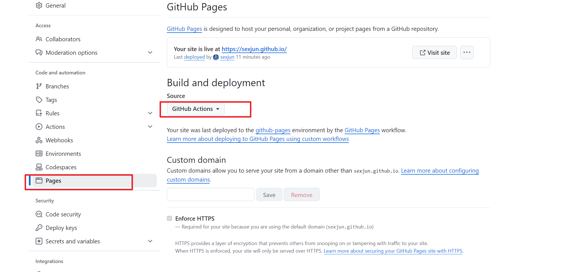
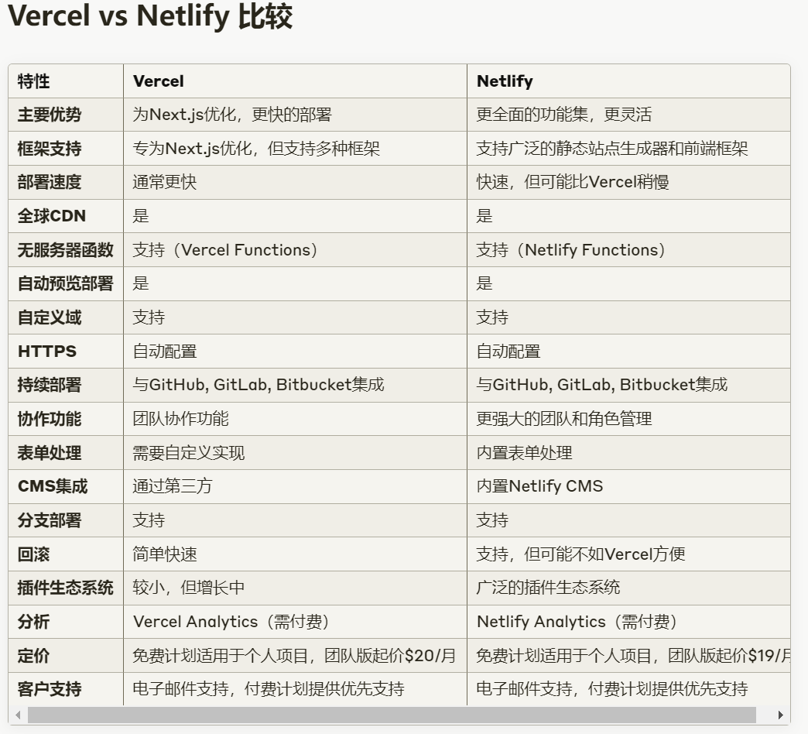

# CN

## 部署到GitHub

修改了workflow： https://github.com/sexjun/sexjun.github.io/commit/4b5e3aad0aff81c371886dccdafb8ae406ae8728

# 部署篇

- GitHub设置



- vercel 和 netlify比较
  

- vercel
  [vercel blog](https://sexjun-github-io.vercel.app/)

- netlify


# 本地开发

```shell
yarn install
yarn dev
```
